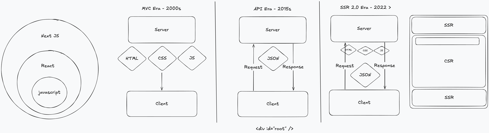

# Class 01 — Introduction to Next.js

What Next.js is, why it exists, and the building blocks of the **App Router**: file-based routing, pages, layouts, dynamic routes, Server vs Client Components, static vs dynamic rendering and styling with Tailwind CSS v4.

## 📁 What's in this folder

| Folder                       | What it is                                                                                   |
| ---------------------------- | -------------------------------------------------------------------------------------------- |
| [`examples/`](./examples)    | A small playground app. Each route shows one concept in isolation — read the comments in the files. |
| [`gatherly/`](./gatherly)    | The course application at the end of class 1: a fresh Next.js project with ESLint, Prettier and VS Code settings configured. |
| `drawing.png`                | The whiteboard diagram from class (below).                                                   |

Run either app with:

```bash
cd class_01_intro/examples   # or class_01_intro/gatherly
npm install
npm run dev
```

Then open [http://localhost:3000](http://localhost:3000).

---

## 🧭 How we got here — the whiteboard



- **Next.js ⊃ React ⊃ JavaScript.** React is a *library* for building UI out of components. Next.js is a *framework* built on React that adds what React leaves out: routing, rendering on the server, data fetching, bundling, image/font optimisation and deployment.
- **MVC era (2000s).** The server (PHP, ASP.NET, Rails…) builds the complete HTML page and sends it with CSS and JS. Fast first load and good SEO, but every click is a full page reload.
- **API era (2015s) — Single Page Apps.** The server only returns **JSON**. The browser gets an almost empty `<div id="root" />` and JavaScript builds the whole UI on the client (Create React App, Vite). Smooth navigation, but a slow first load, a blank page until JS runs, and weak SEO.
- **SSR 2.0 era (2022 →).** The best of both: the server renders HTML for the first load, and React takes over in the browser for interactivity. Parts of a page can be server-rendered (**SSR**) while other parts are interactive client components (**CSR**) — this is exactly what **Server Components** and **Client Components** give us in Next.js.

---

## 🧩 Concepts covered — and where to find them in `examples/`

| Concept                        | Route                                                                     | File(s)                                                     |
| ------------------------------ | ------------------------------------------------------------------------- | ----------------------------------------------------------- |
| A page = a route               | [`/`](http://localhost:3000)                                              | `app/page.tsx`                                              |
| Root layout, metadata, fonts   | every page                                                                | `app/layout.tsx`                                            |
| File-based routing             | [`/routing`](http://localhost:3000/routing)                               | `app/routing/page.tsx`                                      |
| Dynamic route `[id]`           | [`/routing/123`](http://localhost:3000/routing/123)                       | `app/routing/[id]/page.tsx`                                 |
| Nested layouts                 | [`/routing/nested`](http://localhost:3000/routing/nested)                 | `app/routing/nested/layout.tsx`                             |
| Layouts keep state (`<Link>`)  | [`/routing/nested/deeper`](http://localhost:3000/routing/nested/deeper)   | `app/routing/nested/layout.tsx`, `counter.tsx`              |
| Client Component (`'use client'`) | the counter button                                                     | `app/routing/nested/counter.tsx`                            |
| Static rendering               | [`/rendering/static`](http://localhost:3000/rendering/static)             | `app/rendering/static/page.tsx`                             |
| Dynamic rendering              | [`/rendering/dynamic`](http://localhost:3000/rendering/dynamic)           | `app/rendering/dynamic/page.tsx`                            |
| Tailwind, `@theme`, CSS, inline styles | [`/styling`](http://localhost:3000/styling)                       | `app/styling/page.tsx`, `app/globals.css`                   |

> 💡 To really see **static vs dynamic**, run a production build: `npm run build && npm run start`. In `npm run dev` every page is rendered on each request, so both look dynamic.

### Cheat sheet — special files in `app/`

| File         | Purpose                                                               |
| ------------ | --------------------------------------------------------------------- |
| `page.tsx`   | Makes a folder a public route. Its default export is the page UI.     |
| `layout.tsx` | Shared UI that wraps the pages below it. Stays mounted on navigation. |
| `[name]/`    | Dynamic segment — the value is passed in `params` (await it!).        |
| Any other file | Not a route. Safe for components, helpers, CSS next to the page.    |

We'll meet more special files (`loading.tsx`, `error.tsx`, `not-found.tsx`, `route.ts`) in later classes.

---

## 🏋️ Try it yourself

1. Add an `/about` page to `examples/` (hint: a folder and one file).
2. Add a `layout.tsx` to `app/rendering/` with links to both rendering pages. Does it wrap both?
3. Click the counter on `/routing/nested`, then navigate with the links. Now replace one `<Link>` with a plain `<a>`. What happens to the count, and why?
4. Move `'use client'` out of `counter.tsx`. Read the error message — what is it telling you?
5. Add a `--color-brown` token to `@theme` in `globals.css` so that `text-brown` on `/styling` finally works.

---

## 🔗 Useful links

**Next.js**

- [Installation](https://nextjs.org/docs/app/getting-started/installation) — `create-next-app` and its options
- [Project structure](https://nextjs.org/docs/app/getting-started/project-structure) — what every file and folder means
- [Layouts and pages](https://nextjs.org/docs/app/getting-started/layouts-and-pages) — routes, nested layouts, dynamic segments, `PageProps` / `LayoutProps`
- [Linking and navigating](https://nextjs.org/docs/app/getting-started/linking-and-navigating) — `<Link>`, prefetching, client-side transitions
- [Server and Client Components](https://nextjs.org/docs/app/getting-started/server-and-client-components) — when to use `'use client'`
- [CSS](https://nextjs.org/docs/app/getting-started/css) — Tailwind, CSS Modules, global CSS
- [Fonts](https://nextjs.org/docs/app/getting-started/fonts) and [Images](https://nextjs.org/docs/app/getting-started/images)
- [`headers()`](https://nextjs.org/docs/app/api-reference/functions/headers) — reading request headers
- [Rendering philosophy](https://nextjs.org/docs/app/guides/rendering-philosophy) — static and dynamic as a spectrum
- [Next.js Learn course](https://nextjs.org/learn) — free interactive tutorial

**React**

- [Quick start](https://react.dev/learn) and [Thinking in React](https://react.dev/learn/thinking-in-react)
- [Writing markup with JSX](https://react.dev/learn/writing-markup-with-jsx)
- [State: a component's memory](https://react.dev/learn/state-a-components-memory) — `useState`
- [`'use client'` directive](https://react.dev/reference/rsc/use-client) and [Server Components](https://react.dev/reference/rsc/server-components)
- [React Compiler](https://react.dev/learn/react-compiler)

**Tailwind CSS v4**

- [Utility-first fundamentals](https://tailwindcss.com/docs/styling-with-utility-classes)
- [Theme variables (`@theme`)](https://tailwindcss.com/docs/theme)
- [Responsive design](https://tailwindcss.com/docs/responsive-design) and [Dark mode](https://tailwindcss.com/docs/dark-mode)

**Tooling**

- [ESLint in Next.js](https://nextjs.org/docs/app/api-reference/config/eslint)
- [Prettier configuration](https://prettier.io/docs/configuration) and the [Tailwind Prettier plugin](https://github.com/tailwindlabs/prettier-plugin-tailwindcss)
- [TypeScript in 5 minutes](https://www.typescriptlang.org/docs/handbook/typescript-in-5-minutes.html)
